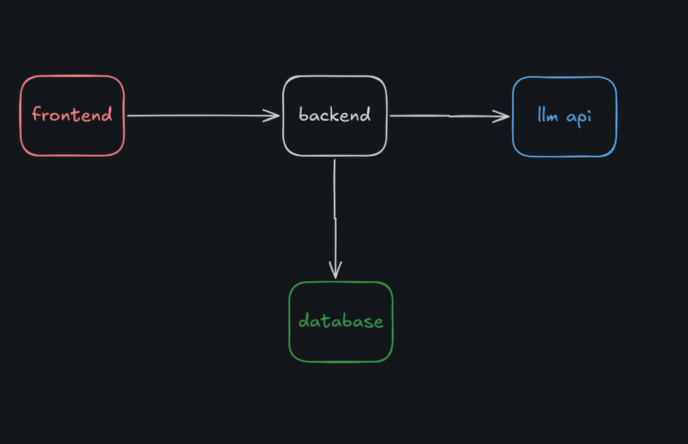

# Prompt flow
```
prompt flow is a system designed to manage, structure and execute sequence of prompts with AI models, where each prompt box(node) is connected to a output box(node) connected via a line(edge).

Enabling to save the AI model responses with its prompt, for future references.
```

## Features
```
1 Prompt Execution: Sends user input to LLM and returns AI-generated responses

2 Message Storage: Saves prompts and responses with user-specific history

3 Node-Based UI: Visual input–output flow using React Flow

4 User Authentication: Secure signup/login and data isolation

5 Pagination: Efficient loading of message history using page-wise data fetching
```

## System architecture



## Database Design (DBML)

```
users [icon: user, color: blue] {
  id string pk
  email string
  password string
  username string
  timestamps Date
}

Message [icon:message-square] {
  id string pk
  prompt string
  response string
  user string fk 
  timestamps Date
}

Message.user > users.id
```

## Tech stack
### Backend
* **Node.js**
* **Express.js**
* **Mongodb** (persistent storage)
* **Mongoose**(ODM)
* **JWT Authentication**
* **JWT Authentication**
* **llm api**

### Frontend
* **React**
* **React Flow**
* **Vite**

## API Routes

### Authentication

| Method    | Endpoint  | Description |
|---------- |----------  |----------|
| POST   | /signup   | Register a new user and generaete JWT   |
| POST  | /signin  | Authenticate user and generate JWT   |

### Prompt 

| Method | Endpoint | Description |
|--------|----------|-------------|
|POST    | /ask-ai  | Get and send the user prompt to llm api
| POST   |/save-message| Save the user prompt & AI respones in the database|
| GET | /get-message | Gets the user saved propt & responses from dataabse|

## env example
```
PORT=5000
MONGO_URI=mongodb://127.0.0.1:27017/promptflow
JWT_SECRET=your_jwt_secret_here
OPENROUTER_API_KEY=your_openrouter_api_key_here
```
## How to set up the project

Clone the repository:

```
git clone https://github.com/Manprabesh/promp-flow.git
```

Change directory 
```
cd frontend/ 
cd backend/
```
Install dependencies for both directories:
```
npm install
```

Start the server for both fronted and backend:

```
npm run dev
```

---

